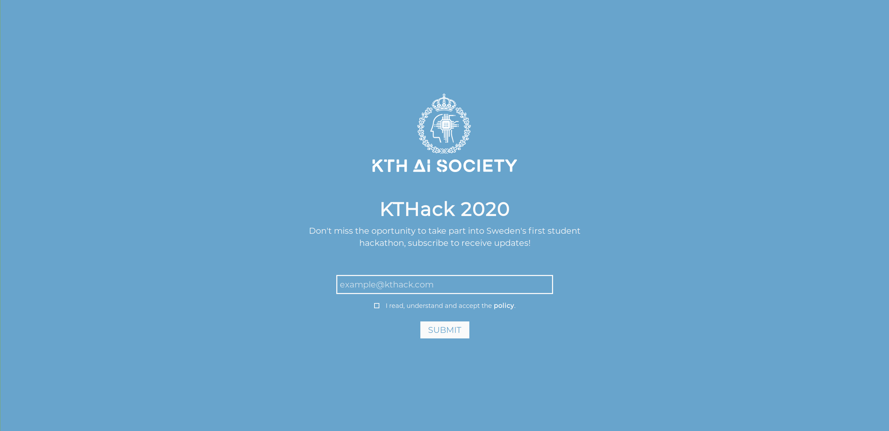

  

<h1 align="center">KTHack subscribe page</h1>

  

## Requirements
* PHP 7.2 or greater
* Composer
* MySQL

## Deploy 
1. Clone repository to your computer with `git clone https://github.com/kthackais/subscribe && cd subscribe`
2. Install PHP and MySQL if needed
3. Run `mysql < db/db.sql` to create the database
4. Create user and set the password with `CREATE USER '[USERNAME]'@'localhost' IDENTIFIED BY '[PASSWORD]';`
5. Give privileges to the user with `GRANT ALL PRIVILEGES ON subscribe.* TO '[USERNAME]'@'localhost'; FLUSH PRIVILEGES;`
6. Move `.env.example` to `.env` and modify it with the corresponding `[USERNAME]` and `[PASSWORD]`
7. Update the Sendgrid API key in `.env` with your own

## License
MIT © KTH Artificial Intelligence Society
